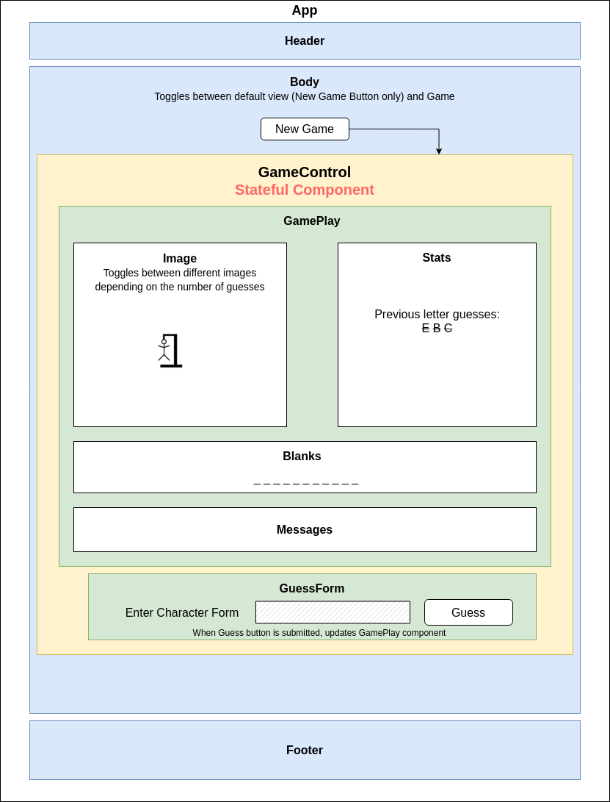

# Hangman

#### React & Redux Exercise for [Epicodus](https://www.epicodus.com/), 04.29.2020

#### By **Adela Darmansyah, Tiffany Siu, Andriy Veremyeyev, Jack Dunning**

[About](#About) | [Component Diagram](##React-Component-Diagram) | [Screenshots](#Screenshots) | [Installation](#Installation-Instructions) | [Bugs](#Known-Bugs) | [Technologies](#Technologies-Used) | [Contact](#Support-and-Contact-Details)

   

## About

**Recreating the game of hangman in Redux.**

### TO-DO

- [ ] Make sure all tests pass
- [ ] Finish writing reducers
- [ ] Make sure used action creators and constants
- [ ] Write game with states
- [ ] Double check the initialState has the correct properties

## React Component Diagram

  

## Screenshots

<!--  -->

## Installation Instructions

* Clone this repository.

* Open the `Command Line Interface` and enter the following:
  * `cd hangman_redux` to navigate into the repository.
  * `npm install` to install all necessary plug-ins.
  * `npm start` to start the application.

## Known Bugs

No known bugs at this time.

## Technologies Used

* HTML
* CSS
* JavaScript
* React
* Redux
* Jest
* Babel
* Draw.io
* Markdown
* _npm*_

_*Check out `package.json` file to see the complete list of all plug-ins._

## Support and Contact Details

Feel free to provide feedback via email: adela.yohana@gmail.com, tsiu88@gmail.com, belyybrat@gmail.com, or JackStunning9001@gmail.com.

### License

This application is licensed under the MIT license.

Copyright (c) 2020 **Adela Darmansyah, Tiffany Siu, Andriy Veremyeyev, Jack Dunning**
